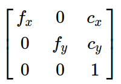
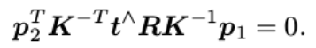
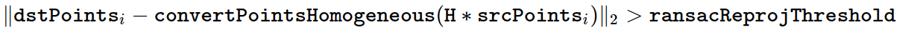
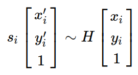
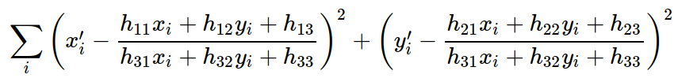
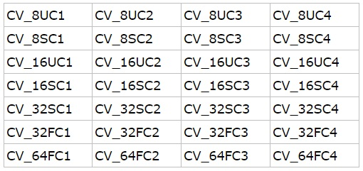

### cv::Ptr`<T>`

A Ptr`<T>` pretends to be a pointer to an object of type T. Unlike an ordinary pointer, however, the object will be automatically cleaned up once all Ptr instances pointing to it are destroyed.

### FeatureDetetor

是虛類，通過定義FeatureDetector的對象可以使用多種特征檢測方法。通過create()函數調用：

Ptr`<FeatureDetector>` FeatureDetector::create(const string& detectorType);

OpenCV 2.4.3 提供了 10 種特征檢測方法：

1. "FAST" – FastFeatureDetector
2. "STAR" – StarFeatureDetector
3. "SIFT" – SIFT (nonfree module)
4. "SURF" – SURF (nonfree module)
5. "ORB" – ORB
6. "MSER" – MSER
7. "GFTT" – GoodFeaturesToTrackDetector
8. "HARRIS" – GoodFeaturesToTrackDetector with Harris detector enabled
9. "Dense" – DenseFeatureDetector
10. "SimpleBlob" – SimpleBlobDetector

```c++
// 使用範例 1
cv::Ptr<cv::FeatureDetector> detector = cv::FeatureDetector::create( "SURF" );

// 使用範例 2
cv::Ptr<cv::FeatureDetector> detector = cv::ORB::create();
```

### ORB::create

The ORB constructor.

```c++
static Ptr<ORB> cv::ORB::create(
    int  	nfeatures = 500,
    float  	scaleFactor = 1.2f,
    int  	nlevels = 8,
    int  	edgeThreshold = 31,
    int  	firstLevel = 0,
    int  	WTA_K = 2,
    int  	scoreType = ORB::HARRIS_SCORE,
    int  	patchSize = 31,
    int  	fastThreshold = 20 
	) 		
```

Parameters

* **nfeatures**: The maximum number of features to retain.
* **scaleFactor**: Pyramid decimation ratio, greater than 1. scaleFactor==2 means the classical pyramid, where each next level has 4x less pixels than the previous, but such a big scale factor will degrade feature matching scores dramatically. 
* **nlevels**: The number of pyramid levels. The smallest level will have linear size equal to input_image_linear_size/pow(scaleFactor, nlevels - firstLevel).
* **edgeThreshold**: This is size of the border where the features are not detected. It should roughly match the patchSize parameter.
* **firstLevel**: The level of pyramid to put source image to. Previous layers are filled with upscaled source image.
* **WTA_K**: The number of points that produce each element of the oriented BRIEF descriptor. The default value 2 means the BRIEF where we take a random point pair and compare their brightnesses, so we get 0/1 response. 

> Other possible values are 3 and 4. For example, 3 means that we take 3 random points (of course, those point coordinates are random, but they are generated from the pre-defined seed, so each element of BRIEF descriptor is computed deterministically from the pixel rectangle), find point of maximum brightness and output index of the winner (0, 1 or 2).

* **scoreType**: The default HARRIS_SCORE means that Harris algorithm is used to rank features (the score is written to KeyPoint::score and is used to retain best nfeatures features); FAST_SCORE is alternative value of the parameter that produces slightly less stable keypoints, but it is a little faster to compute.
* **patchSize**: size of the patch used by the oriented BRIEF descriptor. Of course, on smaller pyramid layers the perceived image area covered by a feature will be larger.
* **fastThreshold**: the fast threshold 

### findFundamentalMat

計算基礎矩陣(E)。

```c++
Mat cv::findFundamentalMat 	(
    InputArray  	points1,
    InputArray  	points2,
    int  	method,
    double  	ransacReprojThreshold,
    double  	confidence,
    int  	maxIters,
    OutputArray  	mask = noArray() 
	) 		
```

#include `<opencv2/calib3d.hpp>`

Calculates a fundamental matrix from the corresponding points in two images.

Parameters
* **points1**: Array of N points from the first image. The point coordinates should be floating-point (single or double precision).
* **points2**: Array of the second image points of the same size and format as points1 .
* **method**: Method for computing a fundamental matrix.
> FM_7POINT for a 7-point algorithm. N=7

> FM_8POINT for an 8-point algorithm. N≥8

> FM_RANSAC for the RANSAC algorithm. N≥8

> FM_LMEDS for the LMedS algorithm. N≥8

* **ransacReprojThreshold**: Parameter used only for RANSAC. It is the maximum distance from a point to an epipolar line in pixels, beyond which the point is considered an outlier and is not used for computing the final fundamental matrix. It can be set to something like 1-3, depending on the accuracy of the point localization, image resolution, and the image noise.
* **confidence**: Parameter used for the RANSAC and LMedS methods only. It specifies a desirable level of confidence (probability) that the estimated matrix is correct.
* **maxIters**: The maximum number of robust method iterations.
* [out]	**mask**: optional output mask

### findEssentialMat

計算本質矩陣(F)。

```c++
Mat cv::findEssentialMat(
    InputArray  	points1,
    InputArray  	points2,
    InputArray  	cameraMatrix,
    int  	method,
    double  	prob,
    double  	threshold,
    int  	maxIters,
    OutputArray  	mask = noArray() 
	) 	
```

#include `<opencv2/calib3d.hpp>`

Calculates an essential matrix from the corresponding points in two images.

Parameters

> **points1**: Array of N (N >= 5) 2D points from the first image. The point coordinates should be floating-point (single or double precision).

> **points2**: Array of the second image points of the same size and format as points1 .

> **cameraMatrix**: Camera intrinsic matrix A=
>> 

>> Note that this function assumes that points1 and points2 are feature points from **cameras with the same camera intrinsic matrix**. 

>> If this assumption does not hold for your use case, use undistortPoints() with P = cv::NoArray() for both cameras to transform image points to normalized image coordinates, which are valid for the identity camera intrinsic matrix. 
 
>> When passing these coordinates, pass the identity matrix for this parameter.

> **method**: Method for computing an essential matrix.

>> RANSAC for the RANSAC algorithm.

>> LMEDS for the LMedS algorithm.

> **prob**: Parameter used for the RANSAC or LMedS methods only. It specifies a desirable level of confidence (probability) that the estimated matrix is correct.

> **threshold**: Parameter used for RANSAC. It is the maximum distance from a point to an epipolar line in pixels, beyond which the point is considered an outlier and is not used for computing the final fundamental matrix. It can be set to something like 1-3, depending on the accuracy of the point localization, image resolution, and the image noise.

> **mask**: Output array of N elements, every element of which is set to 0 for outliers and to 1 for the other points. The array is computed only in the RANSAC and LMedS methods.

> **maxIters**: The maximum number of robust method iterations.

The epipolar geometry is described by the following equation:



where E is an essential matrix, p1 and p2 are corresponding points in the first and the second images, respectively. 

The result of this function may be passed further to decomposeEssentialMat or recoverPose to recover the relative pose between cameras.

### findHomography

```c++
Mat cv::findHomography(
    InputArray  	srcPoints,
    InputArray  	dstPoints,
    int  	method = 0,
    double  	ransacReprojThreshold = 3,
    OutputArray  	mask = noArray(),
    const int  	maxIters = 2000,
    const double  	confidence = 0.995 
	) 	
```

#include `<opencv2/calib3d.hpp>`

Finds a perspective transformation between two planes.

Parameters

> **srcPoints**: Coordinates of the points in the **original plane**, a matrix of the type CV_32FC2 or vector`<Point2f>` .

> **dstPoints**: Coordinates of the points in the **target plane**, a matrix of the type CV_32FC2 or a vector`<Point2f>` .

> **method**: Method used to compute a homography matrix. The following methods are possible:

>> 0 - a regular method using all the points, i.e., the least squares method

>> RANSAC - RANSAC-based robust method

>> LMEDS - Least-Median robust method

>> RHO - PROSAC-based robust method

> **ransacReprojThreshold**: **Maximum allowed reprojection error** to treat a point pair as an inlier (used in the RANSAC and RHO methods only). That is, if

>> 

>> then the point i is considered as an outlier. If srcPoints and dstPoints are measured in pixels, it usually makes sense to set this parameter somewhere in the range of 1 to 10.

> **maxIters**: The maximum number of RANSAC iterations.

> **confidence**: Confidence level, between 0 and 1.

> [out] **mask**: Optional output mask set by a robust method ( RANSAC or LMeDS ). Note that the input mask values are ignored.

The function finds and returns the perspective transformation H between the source and the destination planes:



so that the back-projection error



is minimized.

### triangulatePoints

```c++
void cv::triangulatePoints(
    InputArray  	projMatr1,
    InputArray  	projMatr2,
    InputArray  	projPoints1,
    InputArray  	projPoints2,
    OutputArray  	points4D 
	) 	
```		

#include `<opencv2/calib3d.hpp>`

This function reconstructs 3-dimensional points (in homogeneous coordinates) by using their observations with a stereo camera.

Parameters

> projMatr1: 3x4 projection matrix of the first camera, i.e. this matrix projects 3D points given in the world's coordinate system into the first image.

> projMatr2: 3x4 projection matrix of the second camera, i.e. this matrix projects 3D points given in the world's coordinate system into the second image.

> projPoints1: 2xN array of feature points in the first image. In the case of the c++ version, it can be also a vector of feature points or two-channel matrix of size 1xN or Nx1.

> projPoints2: 2xN array of corresponding points in the second image. In the case of the c++ version, it can be also a vector of feature points or two-channel matrix of size 1xN or Nx1.

> points4D: 4xN array of reconstructed points in homogeneous coordinates. These points are returned in the world's coordinate system.

```
[Note]
Keep in mind that all input data should be of float type in order for this function to work.

If the projection matrices from stereoRectify are used, then the returned points are represented in the first camera's rectified coordinate system.
```

### solvePnP

```c++
bool cv::solvePnP(
    InputArray  	objectPoints,
    InputArray  	imagePoints,
    InputArray  	cameraMatrix,
    InputArray  	distCoeffs,
    OutputArray  	rvec,
    OutputArray  	tvec,
    bool  	useExtrinsicGuess = false,
    int  	flags = SOLVEPNP_ITERATIVE 
	) 	
```

#include `<opencv2/calib3d.hpp>`

Finds an object pose from 3D-2D point correspondences. 

This function returns the rotation and the translation vectors that transform a 3D point expressed in the object coordinate frame to the camera coordinate frame, using different methods:

> P3P methods (SOLVEPNP_P3P, SOLVEPNP_AP3P): need 4 input points to return a unique solution.

> SOLVEPNP_IPPE Input points must be >= 4 and object points must be coplanar.

> SOLVEPNP_IPPE_SQUARE Special case suitable for marker pose estimation. Number of input points must be 4. Object points must be defined in the following order:

>> point 0: [-squareLength / 2, squareLength / 2, 0]

>> point 1: [ squareLength / 2, squareLength / 2, 0]

>> point 2: [ squareLength / 2, -squareLength / 2, 0]

>> point 3: [-squareLength / 2, -squareLength / 2, 0]

> for all the other flags, number of input points must be >= 4 and object points can be in any configuration.

## Mat

> data  
>> uchar類型的指針，指向Mat數據矩陣的首地址。可以理解為標示一個房屋的門牌號；

> dims
>> Mat矩陣的維度，若Mat是一個二維矩陣，則dims=2，三維則dims=3，大多數情況下處理的都是二維矩陣，是一個平面上的矩陣。可以理解為房屋是一個一層的平房，三維或更多維的則是多層樓房；

> rows
>> Mat矩陣的行數。可理解為房屋內房間行數；

> cols
>> Mat矩陣的列數。可理解為房屋內房間列數；

> size()
>> 首先size是一個結構體，定義了Mat矩陣內數據的分布形式，數值上有關系式：

```c++
image.size().width==image.cols;
image.size().height==image.rows
```                                                      

>> 可以理解為房屋內房間的整體布局，這其中包括了房間分別在行列上分布的數量信息

> channels()
>> Mat矩陣元素擁有的通道數。例如常見的RGB彩色圖像，channels==3；而灰度圖像只有一個灰度分量信息， channels==1。

>> 可以理解為每個房間內放有多少床位，3通道的放了3張床，單通道的放了1張床；

> depth
>> 用來度量每一個像素中每一個通道的精度，但它本身與圖像的通道數無關！depth數值越大，精度越高。在 Opencv中，Mat.depth()得到的是一個0~6的數字，分別代表不同的位數，對應關系如下：                            

```c++
enum{CV_8U=0,CV_8S=1,CV_16U=2,CV_16S=3,CV_32S=4,CV_32F=5,CV_64F=6} 
```         

>> 其中 U 是 unsigned 的意思，S 表示 signed，也就是有符號和無符號數。可以理解為房間內每張床可以睡多少人，這個跟房間內有多少床並無關系；

> elemSize
>> elem 是element(元素) 的縮寫，表示矩陣中每一個元素的數據大小。

>> 如果 Mat中的數據類型是 CV_8UC1，那麽 elemSize == 1；如果是 CV_8UC3 或 CV_8SC3 ，那麽 elemSize == 3；如果是 CV_16UC3 或者 CV_16SC3，那麽 elemSize == 6；即 elemSize 是以 8 位（一個字節）為一個單位，乘以通道數和8位的整數倍。

>> 可以理解為整個房間可以睡多少人，這個時候就得累計上房間內所有床位數（通道）和每張床的容納量了；

> elemSize1
>> elemSize 加上一個 “1” 構成了 elemSize1 這個屬性，1可以認為是元素內 1 個通道的意思，這樣從命名上拆分後就很容易解釋這個屬性了：表示 Mat 矩陣中每一個元素單個通道的數據大小，以字節為一個單位，所以有： eleSize1 == elemSize / channels；

> step
>> 可以理解為 Mat 矩陣中每一行的“步長”，以字節為基本單位，每一行中所有元素的字節總量，是累計了一行中所有元素、所有通道、所有通道的 elemSize1 之後的值；

> step1()
>> 以字節為基本單位，Mat 矩陣中每一個像素的大小，累計了所有通道、所有通道的 elemSize1 之後的值,所以有： step1 == step / elemSize1；

> type
>> Mat 矩陣的類型，包含有矩陣中元素的類型以及通道數信息，type 的命名格式為CV_(位數)+(數據類型)+(通道數)，所有取值如下：




## 立體匹配算法(StereoBM, StereoSGBM, StereoBinaryBM, StereoBinarySGBM)

### StereoBM

pass

### StereoSGBM

pass

### StereoBinaryBM

pass

### StereoBinarySGBM

pass

