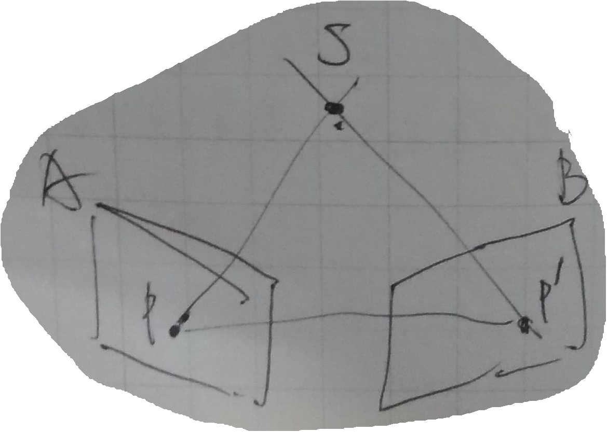
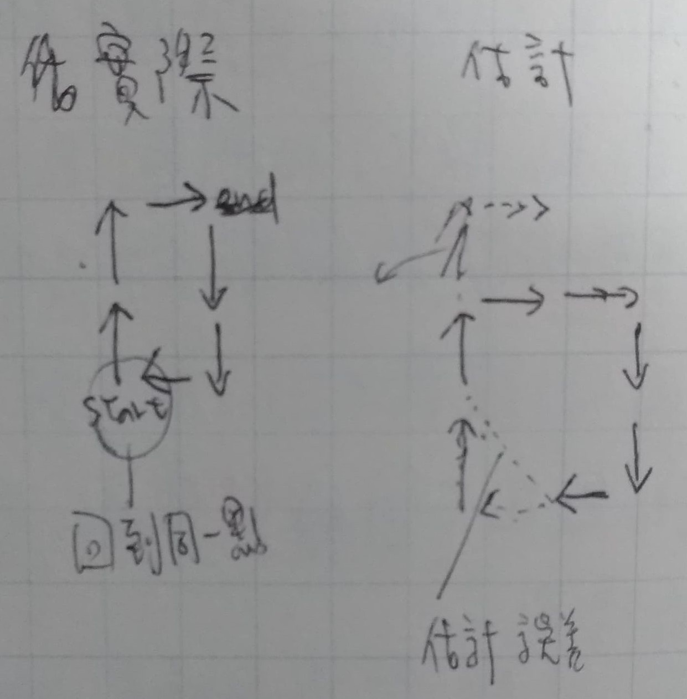

# SLAM

SLAM 是 Simultaneous Localization and Mapping 的縮寫，譯作"同時定位與地圖型建置"。

指的是搭載特定感測器(如相機)的主體，在**沒有環境先驗資訊**的情況下，於**運動過程中**建立**環境**的模型，同時估計自己的**運動**。

整個流程可大致區分為兩部分：**前端**和**後端**。

## 前端(2, 5 ~ 7)

```
透過找出兩兩影像間，相同空間點所映射的像素點，估計相機之間的運動，以及該空間點的位置。
```

1. 兩影像間的相同映射點。→ 特徵點法/直接法
2. → 估計相機之間的運動
3. → 估計空間點的位置

單目 SLAM 或 雙目 SLAM 利用不同相機拍攝到相同的物體的狀態，估計相機之間的運動，以及共同觀測到的物體的空間位置。

令空間點 S 分別映射到相機 A 和 B 上的點為 p 和 p' ，利用 △pSp' 估計線段(pS)，進而估計空間點 S 的位置(x, y, z)。

使用 特徵點法/直接法 找出在 B 當中的 p'(和 A 當中的 p 對應到同一個空間點 S)，利用 p 和 p' 估計相機由 A 到 B 的運動。



## 後端(3, 8)

```
多個影像共同估計彼此的位姿，最小化估計誤差。
```

估計方法：

1. 一階和二階梯度法
2. 高斯牛頓法
3. 列文伯格-馬夸特方法
4. 擴充卡爾曼濾波(EKF)
5. Bundle Adjustment(BA)

## 回路檢測(4, 9)

```
透過找出不同時間點、但相同地點的兩張影像，進行運動的再估計，修正前面所累積的估計誤差。
```

相機運動的過程中，當發生回到同一點(例如相機 C 和 D 拍攝到同一地點)時，估計的空間點們的位置也應相同，
但在前端的估計有誤差，不斷累積便會造成 C 和 D 的位置估計產生誤差。

根據 C 和 D 的誤差來修正到同一個位置時，前面的估計也會有相對應的修正，消弭前面累積的誤差。



## 建圖

將觀測到的影像轉換為模型，根據不同應用有不同的方式來進行建圖，可能應用有下列幾項：

1. 定位：利用全域的描述子資訊，知道相機當前在地圖中的哪裡。
2. 導航：在地圖中進行路徑規劃，在任意兩個地圖點間尋找路徑。
3. 避障：與導航類似，但更注重局部的、動態的障礙物的處理。
4. 重建：主要用於展示，所以希望它看上去更為舒服、美觀。
5. 互動：人和地圖之間是可以互動的，例如向地圖中的牆壁丟擲虛擬的物體，會和牆壁產生碰撞。

<table>
  <tr>
    <td><a href="https://j32u4ukh.github.io/SLAM13/">上一篇</a></td>
    <td><a href="https://j32u4ukh.github.io/SLAM13/">首頁</a></td>
    <td><a href="https://j32u4ukh.github.io/SLAM13/class2.html">下一篇</a></td>
  </tr>
</table>
