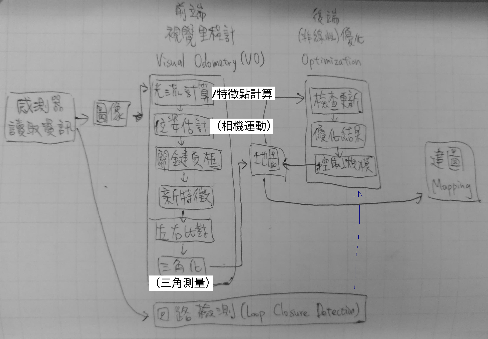

# 建圖

為了將觀測到的影像轉換為模型(稠密重建)，需要知道(大部分)像素點和相機的距離，大致有以下方案：

1. 一元相機：估計相機運動，並利用三角化計算像素的距離。
2. 二元相機：利用左右目的視差計算像素的距離，多目的原理也相同。
3. RGBD相機：直接獲取像素距離。

前兩種方式又稱為"立體視覺(Stereo Vision)"，其中移動一元相機的又稱為"移動角度的立體視覺(Moving View Stereo, MVS)"。

# 整體流程

* 由於建圖會根據需求不同，而有不同設計，是獨立於前後端之外的部份。

<table>
  <tr>
    <td><a href="https://j32u4ukh.github.io/SLAM13/class3.html">上一篇</a></td>
    <td><a href="https://j32u4ukh.github.io/SLAM13/">首頁</a></td>
    <td><a href="https://j32u4ukh.github.io/SLAM13/class5.html">下一篇</a></td>
  </tr>
</table>