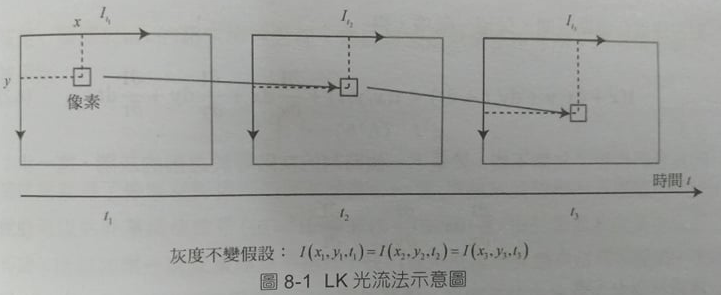

# 影像間匹配點

## 特徵點法

特徵是影像資訊的另一種數位表達形式，在相機運動後保持穩定，能夠從影像中判斷哪些地方是同一點。將特徵點看作固定在 3D 空間的不動點，根據它們在相機中的投影位置，透過最小化『重投影誤差(Reprojection error)』來最佳化相機運動。

特徵點具有以下特質：

1. 可重複性(Repeatability)：相同的特徵可以在不同的影像中找到。
2. 可區別性(Distinctiveness)：不同的特徵有不同的表達。
3. 高效率(Efficiency)：同一影像中，特徵點的數量應遠小於像素的數量。
4. 本機性(Locality)：特徵只與一小片影像區域相關。

特徵點由『關鍵點(Key-Point)』和『描述子(Descriptor)』兩部份組成。

* 關鍵點：指該特徵點在影像裡的位置，有些特徵點還具有朝向、大小等資訊。
* 描述子：通常是一個向量，描述該關鍵點周圍像素的資訊。按照『外觀相似的特徵應該有相似的描述子』的原則設計，因此，只要兩個特徵點的描述子在向量空間上的距離相近，就可以認為它們是同樣的特徵。

### 特徵點/關鍵點 簡介：

1. 尺度不變特徵轉換(Scale-Invariant Feature Transform, SIFT)：考慮在影像轉換過程中出現的光源、尺度、旋轉等變化，但計算量也相當大。

有些特徵算法適當的降低精度和堅固性，以提升計算的速度。

2. FAST 角點分析：找出影像中的『角點』，屬於計算特別快的一種算法(是一種關鍵點，因此沒有描述子)。不具有方向性。
3. ORB(Oriented FAST and Rotated BRIEF)：是非常具有代表性的即時影像特徵。它改進了 FAST 檢測子不具有方向性的問題，並採用速度極快的二進位描述子 BRIEF(Binary Robust Independent Elementary Feature)，使整個影像特徵分析的環節大幅加速。

### 特徵比對

由於影像特徵的局部特性，誤符合(比對錯誤)的情況廣泛存在。部份原因是因為場景中經常存在大量的重複紋理，使得特徵描述十分困難。

這裡暫不考慮誤符合的情況：

1. 『暴力比對(Brute-Force Matcher)』，利用『漢明距離』作為度量，衡量兩兩特徵點之間的距離。最簡單的特徵比對方法。當特徵點數量很大時，運算量將變得很大，不符合 SLAM 的即時性需求。
2. 快速近似最近鄰(FLANN)演算法

## 直接法

// TODO: 極線搜索；逆深度；塊比對；像素梯度問題；影像間的轉換

* 直接法是由光流法演變而來，具有相同的假設條件。光流描述了像素在影像中的運動，而直接法則附帶一個相機運動模型。

* 特徵點法只能恢復成稀疏地圖；直接法可以恢復成半稠密甚至是稠密地圖。

* 『特徵法』中的特徵比對，『直接法』透過最小化『光度誤差(Photometric error)』來求得點與點之間的對應關係。

* 直接法根據影像的『像素灰階資訊/亮度資訊』同時估計相機運動和點的投影，不要求分析的點必須為角點，甚至可以是隨機的選點，完全不用計算關鍵點和描述子。

* 直接法避免了『計算特徵的時間』，也避免了『特徵缺失的情況』。只要場景中存在明暗變化(可以是漸層，不形成局部的影像梯度)，直接法就能工作。

* 在光流法中，1. 先追蹤特徵點的位置 2. 根據 1 估計的位置確定相機的運動。然而這種兩步走的方案(1 → 2)，很難保障全域的最佳性。
而直接法可在後一步，調整前一步的結果(2 → 1)。

假設對於參考影像，測量到一個灰階值為 229 的像素，利用三角測量等方式知道了深度，可以推測空間點 P 的位置。

之後又獲得一幅新的影像，根據前面反覆運算的最佳化結果來估計它的位姿，獲得灰階值為 126，此像素的光度誤差為 229 - 126 ＝ 103。

為了減小這個誤差，會**微調相機的位姿，使像素更亮一些**。

位姿的調整會根據局部的像素梯度，但由於真實影像並不是光滑的，此方法只在該像素附近有效。

只有當相機運動很小，影像中的梯度不會有很強的非凸性時，才能降低落入局部極小值得可能，使直接法得以成立。

* 前項利用單個像素來進行相機位姿估計，會有『單一像素沒有區分度』的問題產生，因為相似灰階值的像素太多了。通常會計算『影像塊』或是『相關性』。

### 光流法

光流是一種描述像素隨時間在影像之間移動的方法。隨著時間的流逝，同一個像素會在影像中運動，而我們希望追蹤它的運動過程。

**稀疏光流**：計算部份的像素運動，以 Lucas-Kanade(LK) 光流為代表；**稠密光流**：計算『所有』像素的運動，以 Horn-Schunck(HS) 光流為代表。

#### Lucas-Kanade 光流



LK 光流認為來自相機的影像是隨時間變化的，影像灰階可看作時間和位置的函數。

**灰階不變假設**：同一個空間點的像素灰階值，在各個影像中是固定不變的。

對於 t 時刻位於 (x, y) 處的像素，令 t + dt 時刻運動到 (x + dx, y + dy) 處，由於灰階不變假設，有： I(x + dx, y + dy, t + dt) = I(x, y, t)。

```
『灰階不變假設』是一個很強的假設，實際中很有可能不成立。
```

##### 多層光流

如果相機運動較快，兩張影像差異較明顯，那麼『單層影像光流法』容易達到一個『局部極小值』，這種情況可以利用影像金字塔來改善。

**影像金字塔**：對同一影像進行縮放，獲得不同解析度下的影像。

<table>
  <tr>
    <td><a href="https://j32u4ukh.github.io/SLAM13/class4.html">上一篇</a></td>
    <td><a href="https://j32u4ukh.github.io/SLAM13/">首頁</a></td>
    <td><a href="https://j32u4ukh.github.io/SLAM13/class6.html">下一篇</a></td>
  </tr>
</table>