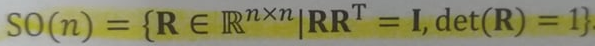

# (相機)運動

前端所在作的事，以一句話說明就是：『透過找出兩兩影像間，相同空間點所映射的像素點，估計相機之間的運動，以及該空間點的位置。』

這裡打算先說明如何『描述』相機之間的運動。


C1, C2 分別為兩個相機，空間點 P 分別映射到兩個相機的『成像平面』上的像素點，命名為 p1, p2。

空間點 P 從不同座標系去描述，位置也會不同。在 C1 相機座標系下為 Pc1，而從 C2 相機座標系下為 Pc2。
位置描述由 Pc1 變為 Pc2，也可以看成是相機由 C1 運動到 C2。

相機運動是一種『剛體運動』，由一個『旋轉』加上一個『平移』組成。這個過程中，只可能有位置描述和姿態的不同，而它的長度、各個面的角度等性質不會有任何改變，可說 C1, C2 之間差了一個『歐式轉換(Euclidean Transform)』。

世界座標到相機座標，或是 C1 相機座標系到 C2 相機座標系都是『歐式轉換(Euclidean Transform)』。

其中的平移向量，從原始座標系來看，其實就是新座標系在原始座標系下的『位置』。而原始座標系在旋轉後到，指向和新座標系相同的方向，可以說是它的『姿勢』。

兩者合稱為『位姿』，若是相對於世界座標，那就可作為該相機的狀態描述(位置 與 姿勢)，而不只是相機之間的運動。

有點像 向量(ab) 在描述 a 點到 b 點的運動，若 a 點是座標系的原點，則 向量(ab) 等價於 b 點在該座標系下的『位置』。

## 旋轉

歐式轉換由『旋轉』和『平移』組成,首先單純考慮旋轉，利用一個矩陣(R)來描述旋轉，稱之為『旋轉矩陣(Rotation Matrix)』。

```
a' = Ra
```

旋轉矩陣由兩個座標系組成，帶有一些特別的性質：它是一個行列式為1的『正交矩陣(矩陣的『逆』和『轉置』是一樣的矩陣)』。

反過來說，一個行列式為1的『正交矩陣』就會是一個『旋轉矩陣』。因此可將 n 維旋轉矩陣的集合定義為：



SO(n) 是『特殊正交群(Special Orthogonal Group)』的意思，SO(3) 只的就是 3D 空間中的旋轉。

```
『群』簡單來說就是：有特殊要求的矩陣，符合該要求的矩陣的集合稱為 XX 群，例如 『特殊正交群』。
```

## 平移

平移相當單純，只須將描述平移的向量(t)加到旋轉過後的座標上即可。

```
a' = Ra + t
```

## 轉換矩陣(Transform Matrix)

『轉換矩陣(T)』將旋轉矩陣和平移向量所帶來的轉換，透過『齊次座標』的形式，重新定義在同一個矩陣。又稱為『歐式轉換(Euclidean Transform)』。

同樣有特殊的結構：左上為旋轉矩陣，右上為平移向量，左下為 0 向量，右下為 1。這種矩陣又被稱為『特殊歐式群(Special Euclidean Group)』。

## 其他轉換

1. 相似轉換：歐式轉換 + 縮放，3D 相似轉換集合稱為『相似轉換群 Sim(3)』。
2. 仿射轉換：僅要求左上的 3*3 矩陣為『可逆矩陣』，不必是正交矩陣，又稱『正交投影』。仿射轉換後，正方形會變成平行四邊形。
3. 射影轉換：是最普遍的轉換，左上的 3*3 矩陣為『可逆矩陣』，右上為平移向量，左下為縮放向量，右下為齊次座標(x, y, z, w)的 w 項。真實世界到相片即為『射影轉換』，正方形在射影轉換後會變成不規則四邊形。

<table>
  <tr>
    <td><a href="https://j32u4ukh.github.io/SLAM13/class4.html">上一篇</a></td>
    <td><a href="https://j32u4ukh.github.io/SLAM13/">首頁</a></td>
    <td><a href="https://j32u4ukh.github.io/SLAM13/class6.html">下一篇</a></td>
  </tr>
</table>