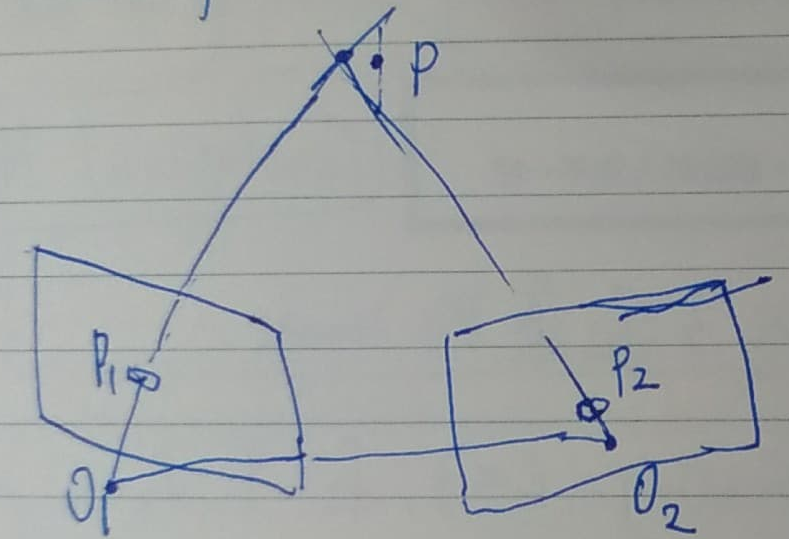

# 估計空間點的位置

二元相機：利用左右目視差計算像素的距離，多目的原理相同。

## 三角測量

利用『三角測量(Triangulation)/三角化』的方法估計地圖點的深度。

透過不同位置對同一路標點進行觀察，從觀察到的位置推斷路標點的距離。

理論上 向量(O1P1) 和 向量(O2P2) 會在場景中相交於一點 P，但由於雜訊影響的關係，兩向量通常無法相交。

> 三角測量是由"平移"而獲得的，沒有平移的純旋轉是無法計算的。

## 反覆運算最近點(Iterative Closest Point, ICP)

二元相機、REB-D 相機或透過某種方式獲得了距離資訊，則可利用 ICP 以及兩組 3D 點來估計運動。

3D-3D 位姿估計問題中，沒有利用到相機模型，僅利用兩組 3D 點之間的轉換來估計運動。

ICP 的求解分為兩種方式：

1. 線性代數求解(主要是 SVD)
2. 非線性最佳化求解(類似 BA)

<table>
  <tr>
    <td><a href="https://j32u4ukh.github.io/SLAM13/class6.html">上一篇</a></td>
    <td><a href="https://j32u4ukh.github.io/SLAM13/">首頁</a></td>
    <td><a href="https://j32u4ukh.github.io/SLAM13/class8.html">下一篇</a></td>
  </tr>
</table>