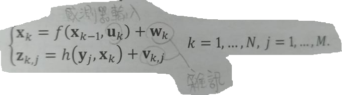
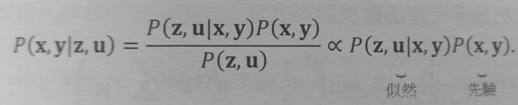
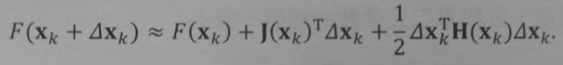

# 後端

『SLAM 模型』由『運動方程式』和『觀測方程式』組成：



由於方程式都會受到雜訊影響，因此應假設『位姿 x』和『路標 y』服從某種機率分佈的隨機變數，而非明確的數值。

則問題變成：『當擁有 輸入資料 u 和 觀測資料 z 時，如何確定狀態 x, y 的條件機率分佈？』

P(x, y| z, u) 稱為『後驗機率』，可利用貝氏法則得到



分母部份 P(z, u) 與待估計的狀態 x, y 無關，因此可忽略。分解後的左式稱為『**似然(Likehood)**』，右式稱為『**先驗(Prior)**』。

直接求後驗分佈是困難的，但『求一個狀態最佳估計，使得該狀態下後驗機率最大化』是可行的：

```
MAP(x, y) = argmax P(x, y| z, u) = argmax P(z, u | x, y) * P(x, y)
```

上式告訴我們，求解『最大後驗機率』相等於『最大化 似然和先驗的乘積』。

若缺乏『先驗(相機位姿或路標大概在哪裡)』，則可求解『最大似然估計(Maximize Likelihood Estimation, MLE)』：

```
MLE(x, y) = argmax P(z, u | x, y)
```

似然：『在現在的位姿下，可能產生怎樣的觀測資料。』
最大似然估計：『在怎樣的狀態下，最可能產生現在觀測到的資料。』

## 最小平方法(求最大似然估計)

假設最大似然服從高斯分佈，考慮**單次觀測**的最大似然估計，使用『最小化負對數(有較好的數學形式)』來求解。
由於對數函數是單調遞增的，所以『對原函數求最大化』相當於『對負對數求最小化』。

最小化上式右側的二次型項，則獲得對狀態的最大似然估計。這個二次型稱為『馬哈拉諾比斯距離(Mahalanobis)』，又叫『馬式距離』。
它可以看成由 Q^-1_k,j 加權之後的歐式距離(二範數)，這個 Q^-1_k,j 也叫做**資訊矩陣**，即高斯分佈共變異數矩陣之逆。

---

考慮**批次資料**，通常假設各個時刻的輸入和觀測是相互獨立的，各個輸入之間也是獨立的，各個觀測之間也是獨立的，於是可以對聯合分佈進行因式分解：

定義各次輸入和觀測資料與模型之間的誤差為：

最小化所有時刻估計值與真實讀數之間的馬式距離，相當於求最大似然估計，負對數允許我們把乘積變成求和：

將問題轉變成『最小平方問題(Least Square Problem)』。

## 非線性最小平方法

對複雜的函式求解最小平方問題，需要知道目標函式的**全域性質**，而這通常不太可能。這種情況可用**反覆運算**的方式，從一個初值出發，不斷更新目前的最佳化變數。

實際步驟如下：

1. 指定某個初值 X0。
2. 對於第 k 次反覆運算，尋找一個增量 ⊿Xk，使得增量後帶入目標函式達到極小值。
3. 若 ⊿Xk 足夠小，則停止。
4. 否則，令 X_k+1 = Xk + ⊿Xk，傳回第 2 步。

這讓『求解導函數為零』的問題，變成一個『不斷尋找下降增量 ⊿Xk』的問題。

### 一階和二階梯度法

考慮第 k 次反覆運算，假設在 Xk 處，想要尋找到增量 ⊿Xk。在目標函數的 Xk 處附近進行泰勒展開。



其中 J(Xk) 是 F(X) 關於 X 的一階導數(也叫梯度、雅可比(Jacobian)矩陣)，H 則是二階導數(黑塞(Hessian)矩陣)。

* 保留一階梯度：最速下降法。過於貪心，容易走出鋸齒路線，反而增加了反覆運算次數。
* 保留二階梯度：牛頓法。需要計算目標函數的 H 矩陣，在問題規模較大時非常困難，通常會避免對 H 的計算。
* 高斯牛頓法
* 列文伯格-馬夸特方法

### 高斯牛頓法

對 f(x) 進行一階的泰勒展開，而非目標函式 F(x)。

這個方程式是關於變數 ⊿Xk 的線性方程組，稱為**增量方程式**，或稱『高斯牛頓方程式(Gauss-Newton equation)』、『正規方程式(Normal equation)』。

利用 J 來近似 H,進一步省略了 H 的計算。求解增量方程式是整個最佳化問題的核心，步驟如下：

1. 指定某個初值 X0。
2. 對於第 k 次反覆運算，求出目前的雅可比矩陣 J(Xk) 和 誤差 f(Xk)。
3. 求解增量方程式： H⊿Xk = g。
4. 若 ⊿Xk 足夠小，則停止。否則，令 X_k+1 = Xk + ⊿Xk，傳回第 2 步。

### 列文伯格-馬夸特方法

修正了一些高斯牛頓法的問題，一般認為較為穩固，但收斂速度也因此較慢，被稱為『阻尼牛頓法(Damped Newton Method)』。

高斯牛頓法中採用的近似二階泰勒展開只能在展開點附近有較好的近似效果，因此可以替 ⊿X 增加一個範圍，稱為『信賴區間(Trust Region)』。
這個範圍定義了在什麼情況下二階近似是有效的，因此這個方法又稱為『信賴區間方法(Trust Region Method)』。

步驟如下：

1. 指定某個初值 X0，和初始最佳化半徑 μ。
2. 對於第 k 次反覆運算，在高斯牛頓法的基礎上加上信賴區間，求解：

其中，μ 是信賴區間的半徑，D 是係數矩陣。
『列文伯格』提出的 D 為單位矩陣 I，相當於直接把 ⊿X 約束在一個球中。『馬夸特』將 D 取成非負數對角陣 ─ 實際中通常用 `J^T * J` 的對角元素平方根，使得在梯度小的維度上約束範圍更大一些。

3. 計算 ρ，若 ρ > 3/4，則設定 μ = 2μ;若 ρ < 1/4，則設定 μ = 0.5μ。
4. 若 ρ 大於某設定值，則認為近似可行，令 X_k+1 = Xk + ⊿Xk。
5. 判斷演算法是否收斂，若不收斂，則傳回第 2 步，否則結束。

使用『拉格朗日乘子(λ)』把約束項放到目標函數中，組成拉格朗日函數

『列文伯格-馬夸特方法』相當於融合了『高斯牛頓法』和『最速下降法』。
當 λ 較小時，H 佔主要地位，二次近似模型在該範圍是比較好的，較接近『高斯牛頓法』。當 λ 較大時，λI 佔主要地位，說明附近的二次近似不夠好，較接近『一階梯度下降法(最速下降法)』。

## 漸進式 狀態估計

已知『批次狀態估計問題』可以轉化為『最大似然估計問題』，並使用『最小平方法』進行求解。

考慮第 k 時刻的情況，用過去 0 到 k 中的資料來估計現在的狀態分佈：

根據貝氏法則，第一項為**似然**，第二項為**先驗**：

先驗部份，狀態 Xk 是以過去所有為基礎的狀態，至少會受到 X_k-1 影響，於是以 X_k-1 時刻為條件機率展開：

由於上式還沒有實際的機率分佈形式，所以無法實際操作它。可以有下列 2 種方法：

1. 假設馬卡夫性，使用**擴充卡爾曼濾波(EKF)**為代表的濾波器方法。
2. 考慮 k 時刻和過去**所有**狀態的關係的**非線性最佳化**為主體的最佳化框架。

### 擴充卡爾曼濾波(EKF)

* 只在固定點上做『一次』泰勒展開。
* 儲存狀態量的平均值和變異數，隨著場景變大，儲存量也會變很大，普遍認為不適用於大型場景。
* 沒有例外檢測的機制，誤比對將使得系統不穩定。

### 非線性最佳化(BA 與圖最佳化)

在同等計算量下，非線性最佳化較 EKF 能取得更好(精度＆堅固性)的效果。

* 滑動視窗濾波(SWF)：透過 Schur + 邊緣化，控制 BA 規模。
* 當邊緣化某個 key frame 即『保持這個 key frame 目前的估計值，求其他狀態變數以這個 key frame 為條件的條件機率』。
* 某個 key frame 被邊緣化，它觀測到的路標點就會產生一個『這些路標點應該在哪裡』的先驗資訊。
* 若再邊緣化這些路標點，則獲得『觀測它們的 key frame 應該在哪裡』的先驗資訊。

<table>
  <tr>
    <td><a href="https://j32u4ukh.github.io/SLAM13/class7.html">上一篇</a></td>
    <td><a href="https://j32u4ukh.github.io/SLAM13/">首頁</a></td>
    <td><a href="https://j32u4ukh.github.io/SLAM13/class9.html">下一篇</a></td>
  </tr>
</table>