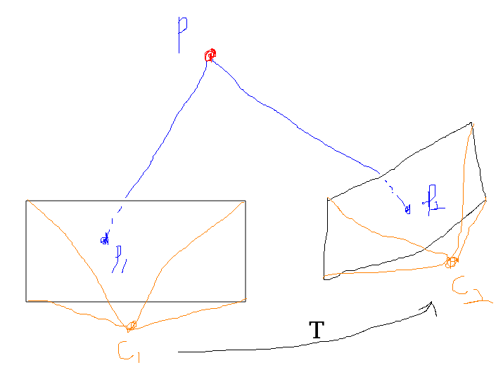

# 運動

SLAM 是在『相機運動』過程中建立環境的模型，在定義座標系時，通常會設定一個慣性座標系(或叫世界座標系)，可以認為它是固定不動的，而相機是一個移動座標系，SLAM 的運算過程中，經常需要對兩個座標系下的座標進行轉換。

兩個座標系之間的運動由一個『旋轉』和一個『平移』組成，這種運動稱為『剛體運動』。可以想像將手機拋到空中，在它落地前，只可能有空間位置和姿態的不同，而它的長度、各個面的角度等性質不會有任何變化。兩座標系之間，差了一個『歐式轉換(Euclidean Transform)』。

> **剛體**(rigid body)是一種有限尺寸，可以忽略形變的固體。不論是否感受到外力，在剛體內部，質點與質點之間的距離都不會改變。這種理想模型適用條件是，運動過程比固體中的彈性波的傳播要緩慢得多。


剛體運動的過程中，將相機視為 3D 空間的剛體，具有『位置(在空間中的哪個地方)』和『姿態(相機的朝向)』兩項性質，可用於描述相機的狀態，比如『相機位於空間(0, 0, 0)點處，朝向正前方』，位置與姿態合稱為『位姿』。

就像 向量(ab) 在描述 a 點到 b 點的運動，若 a 點是座標系的原點，則 向量(ab) 等價於 b 點在該座標系下的『位置』。

* 位姿 = 位置 + 姿態，用來描述座標系(比如相機)的狀態。
* 座標系(比如相機)之間的運動 = 平移 + 旋轉，若是在描述相對於『世界座標』的運動，則等價於其在世界座標下的『位置』和『姿態』。也就是說，可以用『位姿』來描述『兩個座標系之間的運動』。

向量 P 在世界座標系中的座標為 P_w，在相機座標系下的座標為 P_c，若要轉換兩個座標系下的座標，需要先獲得 P_c 再根據相機的『位姿』轉換到世界座標系。

## 旋轉

歐式轉換由旋轉和平移所組成，首先討論旋轉。當座標系的基 (e1, e2, e3) 在旋轉後變成 (e1', e2', e3')，對同一個向量 a(該向量並未隨著座標系的旋轉而發生運動)，在兩個座標系下的座標分別為 (a1, a2, a3) 和 (a1', a2', a3')。

> 基(e1, e2, e3)：一組線性無關的向量，張成一個空間。例如：[[1, 0, 0], [0, 1, 0], [0, 0, 1]]。
> 任意向量 a 在這組基下有座標：
>
> 

由於向量本身沒變，所以根據座標的定義有：


對上式的兩邊同時左乘 [e^T_1, e^T_2, e^T_3]^T，則左邊係數變為單位矩陣，


將中間的矩陣取出，定義乘一個矩陣 R，由兩組基之間的內積組成，刻劃了『旋轉前後，同一個向量的座標轉換關係』。
由於基向量的長度為 1，所以實際上是各基向量夾角的餘弦值。

矩陣 R 描述了旋轉本身，因此稱為『旋轉矩陣(Rotation Matrix)』，又因為是由餘弦值所構成，又稱為『方向餘弦矩陣(Direction Cosine Matrix)』。

旋轉矩陣有一些特別的性質：它是一個行列式為1的『正交矩陣』。反過來說，一個行列式為 1 的『正交矩陣』就會是一個『旋轉矩陣』。因此可將 n 維旋轉矩陣的集合定義為：


SO(n) 是『特殊正交群(Special Orthogonal Group)』的意思，SO(3) 指的就是 3D 空間中的旋轉。

> 『群』簡單來說就是：有特殊要求的矩陣，符合該要求的矩陣的集合稱為 XX 群，例如 『特殊正交群』。

由於旋轉矩陣為正交矩陣，它的**逆**和**轉置**描述了同一個相反的旋轉：

```
Ra = a'
R^-1 * a' = R^T * a' = a
```

## 轉換矩陣 與 齊次座標

歐式轉換除了旋轉外，還有平移。只須將平移向量加到旋轉之後的座標上即可。可以表示成：


然而此形式的表示，在轉換多次後就會顯的臃腫，『轉換矩陣(T)』將旋轉矩陣和平移向量所帶來的轉換，透過『齊次座標』的形式，重新定義在同一個矩陣：


同樣有特殊的結構：左上為旋轉矩陣，右上為平移向量，左下為 0 向量，右下為 1。這種矩陣又被稱為『特殊歐式群(Special Euclidean Group, SE)』。


轉換矩陣的逆表示為：


## 旋轉向量

用矩陣表示旋轉有以下缺點：

1. SO(3) 的旋轉矩陣有 9 個量，但一次旋轉只有 3 個自由度；轉換矩陣使用 16 個量表達 6 個自由度的轉換。這些表示方式具有容錯性，但不夠緊湊，最好可以用 3 維向量表示旋轉；用 6 維向量表達轉換。
2. 旋轉矩陣、轉換矩陣 皆帶有約束，當想估計或最佳化時，這些約束使得求解變得更加困難。

**旋轉向量(Axis-Angle)**：向量方向與旋轉軸相同，而長度等於旋轉角。

考慮某個用 R 表示的旋轉，旋轉軸為一個單位長度的向量 n，角度為 θ，則可用 θn 來描述這個旋轉。

旋轉向量可利用『羅德里格斯公式(Rodrigues's Formula)』轉換成旋轉矩陣：


旋轉矩陣亦可透過取『跡(矩陣對角線元素的和)』轉換成旋轉向量：


而旋轉軸 n 在旋轉後不發生改變，即 `Rn = n`。矩陣 R 特徵值 1 對應的特徵向量歸一化後得到旋轉軸 n。

之後會發現，這正是 SO(3) 上，李群與李代數的對應關係。

## 歐拉角(Euler Angle)

雖然旋轉矩陣和旋轉向量都能描述旋轉，但對人類而言不夠直觀，**歐拉角**使用 3 個分離的轉角，把一個旋轉分解成 3 次繞不同軸的旋轉。

通常會使用『偏航(yaw)-俯仰(pitch)-滾轉(roll)』 3 個角度來描述一個旋轉，相當於 ZYX 軸的旋轉：

1. 繞物體的 Z 軸旋轉，獲得『偏航角(yaw)』。
2. 繞**旋轉之後**的 Y 軸旋轉，獲得『俯仰角(pitch)』。
3. 繞**旋轉之後**的 X 軸旋轉，獲得『滾轉角(roll)』。


然而歐拉角有個重大的缺點，『萬向鎖問題(Gimbal Lock)』：當俯仰角(pitch)為 ±90 度時，第一次旋轉和第三次旋轉將使用同一個軸，使得系統損失一個自由度(由 3 次旋轉變成 2 次旋轉)，這被稱為『奇異性問題』。

## 四元數(Quaternion)

* 旋轉矩陣用 9 個量描述 3 個自由度的旋轉，具有容錯性，但不緊湊。
* 歐拉角和旋轉向量用 3 個量描述 3 個自由度的旋轉，是緊湊的，但具有奇異性。

理論上可證明，只要想用 3 個實數來表達 3 維旋轉，勢必會遇到奇異性問題。這有點類似用經緯度表示地球表面座標，當緯度超過 ±90 度時，緯度便無意義。

這裡導入『四元數(Quaternion)』(類似複數，但不完全相同)來表達，既是緊湊的，也沒有奇異性。

> 當想要將複平面的向量旋轉 θ 度時，可以給這個複向量乘以 e^iθ，這是極座標表示的複數，也可利用歐拉公式，寫成普通的形式：


這正是一個單位長度的複數。在二維的情況下，旋轉可以由**單位複數**來描述，同樣的，3 維旋轉可由**單位四元數**來描述。

一個四元數 q 有一個實部和三個虛部(i, j, k)，表示成 `q = q0 + q1 * i + q2 * j + q3 * k`，虛部滿足以下關係式：


有時也用一個純量和一個向量來表達四元數：


s 稱為實部，v 為虛部。若一四元數的虛部為 0，則稱為**實四元數**；若它的實部為 0，則稱為**虛四元數**。

我們可用一個**單位四元數**描述 3 維空間的任一旋轉，但表達方式與複數實際上有些不同。在複數中，乘以 i 表示繞 i 軸旋轉 90 度；而在四元數當中 i * j = k，並不表示『先繞 i 軸旋轉 90 度，再繞 j 軸旋轉 90 度，就等於繞 k 軸旋轉 90 度』。實際上應該是『乘以 i 表示繞 i 軸旋轉 180 度；而 i^2 = -1 表示旋轉 360 度後，獲得一個相反的東西，需要繞兩圈才會和原本相同』。

### 四元數的運算

令 q_a = s_a + x_a * i + y_a * j + z_a * k, q_b = s_b + x_b * i + y_b * j + z_b * k：

也可寫成 q_a = [s_a, v_a]^T, q_b = [s_b, v_b]^T

1. 加法和減法：q_a ± q_b = [s_a ± s_b, v_a ± v_b]^T

2. 乘法：將各項分別相乘，虛部再根據 i, j, k 分別加總


以向量形式表示為：


關於最後一項的外積，四元數的乘法通常是不可交換的，除非 v_a 和 v_b 在 R^3 裡共線，此時外積為零。

3. 模長：


兩個四元數乘積的模長，即為模長的乘積： || q_a * q_b || = || q_a || * || q_b ||

4. 共軛：將虛部取成相反數，即為共軛： q_a* = s_a - x_a * i - y_a * j - z_a * k = [s_a, -v_a]^T

四元數共軛與自身相乘，會得到一個實四元數，實部為模長的平方：`q*q = qq* = [s^2 + v^Tv, 0]^T`

5. 逆：q^-1 = q* / || q ||^2

由此可知，四元數和自己的逆的乘積為實四元數 1： qq^-1 = q^-1q = 1。

如果 q 為單位四元數，其逆和共軛就是同一個量，同時，乘積的逆具有和矩陣類似的性質： (q_a * q_b)^-1 = q_b^-1 * q_a^-1

6. 數乘：和向量相似，可以直接和純量相乘 kq = [ks, kv]^T

### 用四元數表示旋轉

假設一空間 3D 點 p = [x, y, z] 屬於 R^3，旋轉後變成 p'，為利用四元數 q 來表示旋轉，須先將 p 以虛四元數的形式來描述，

p = [0, x, y, z]^T = [0, v]^T

則旋轉後的 p' 表示為： p' = qpq^-1

### 四元數到其他旋轉

首先將四元數 q = [s, v]^T 以下列的矩陣形式：


則四元數乘法可以寫成：


以矩陣形式的四元數進行旋轉時，可表示為：


因為 p 和 p' 都是虛四元數，所以矩陣的右下角即列出了**從四元數到旋轉矩陣**的轉換關係：


再透過對兩側求跡：


得到旋轉轉向量的角度，而旋轉軸為 q 的虛部取單位向量(除以模長)：


## 其他轉換

1. 相似轉換：較歐式轉換多一個自由度，相當於 歐式轉換 + 縮放，矩陣表示：


旋轉部份多了一個縮放因數 s，表示在對向量進行旋轉後，可在 x, y, z 上進行均勻縮放。相似轉換後不再保持圖形的面積不變，但立方體在相似轉換仍是立方體。3D 相似轉換集合稱為『相似轉換群 Sim(3)』。

2. 仿射轉換：僅要求左上的 3*3 矩陣為『可逆矩陣』，不必是正交矩陣，又稱『正交投影』。仿射轉換後，正方形會變成平行四邊形。
矩陣表示：


3. 射影轉換：是最普遍的轉換，左上的 3*3 矩陣為『可逆矩陣』，右上為平移向量，左下為縮放向量，右下為齊次座標(x, y, z, w)的 w 項。真實世界到相片即為『射影轉換』，正方形在射影轉換後會變成不規則四邊形。矩陣表示：


---

描述旋轉的『特殊正交群(Special Orthogonal Group，SO)』，以及描述轉換的『特殊歐式群(Special Euclidean Group, SE)』，皆屬於『李群』的一種。

---

外積(a X b)：是一個向量，方向垂直於 a 和 b，大小為|a| * |b| * sin(a, b)，是兩個向量張成的四邊形的有向面積。可將 a X 寫成『反對稱矩陣(Skew-symmetric Matrix)』，使得外積的運算變成矩陣和向量的相乘。


---



*C1, C2 分別為兩個相機，空間點 P 分別映射到兩個相機的『成像平面』上的像素點，命名為 p1, p2。*

若要描述 C1 如何運動到 C2，可用位姿 T(12) 來表達 C1 在經過一個『旋轉』和一個『平移』，變成和 C2 相同的位置與姿態。

這個過程中，只可能有位置描述和姿態的不同，而它的長度、各個面的角度等性質不會有任何改變，可說 C1, C2 之間差了一個『歐式轉換(Euclidean Transform)』。

世界座標到相機座標，或是 C1 相機座標系到 C2 相機座標系都是『歐式轉換(Euclidean Transform)』。

當相機由 C1 運動到 C2，空間點 P 在相機座標系下的位置由 Pc1 變到 Pc2。

反過來，也可以利用 Pc1 和 Pc2 的關係，推論相機如何由 C1 運動到 C2，計算出『旋轉(R)』和『平移(t)』。

## 運動估計

不同的數據有不同的估計方式：

1. 一元相機：利用『對極 幾何/約束』和兩組 2D 點來估計運動。
2. 二元相機、RGB-D 相機或透過某種方式獲得了距離資訊，則可利用 ICP 以及兩組 3D 點來估計運動。
3. 一組 3D 點、一組 2D 點，即獲得了一些 3D 點和他們在相機的投影位置，利用 PnP 來估計運動。 
