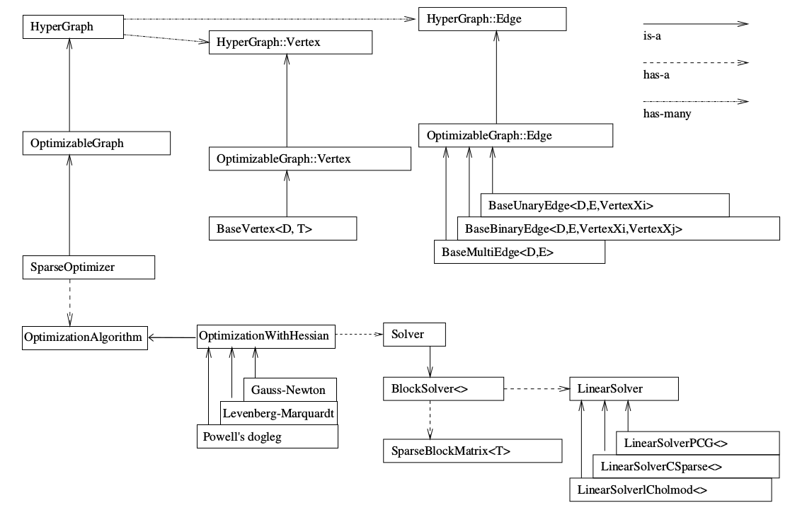

### 圖最佳化理論簡介

* 一個『圖』(Graph)由多個『頂點』(Vertex)，以及連接著這些頂點的『邊』(Edge)組成。
* 用頂點表示最佳化變數，用『邊』表示誤差項。
* 只有一個頂點的圖，稱為『一元邊』(Unary Edge)。

### 步驟

1. 定義『頂點』(最佳化變數)和『邊』(誤差項)的類型。
2. 建製圖。
3. 選擇最佳化演算法。
4. 呼叫 g2o 進行最佳化，傳回結果。

### BaseVertex

* read，write：分別是讀盤、存盤函數，一般情況下不需要進行讀/寫操作的話，僅僅聲明一下就可以

* setToOriginImpl：頂點重置函數，設定被優化變量的原始值。

* oplusImpl：頂點更新函數。非常重要的一個函數，主要用於優化過程中增量 △x 的計算。我們根據增量方程計算出增量之後，就是通過這個函數對估計值進行調整的，因此這個函數的內容一定要重視。

> 該函數處理的是 X_k+1 = X_k + △x 的過程，若最佳化變數位於向量空間中，這個更新就是簡單的加法；但若不在向量空間，例如相機位姿就不具有加法運算，就需要定義**增量如何加到現有的估計上**的行為了，例如位姿利用左乘或右乘。

### BaseUnaryEdge

* read，write：分別是讀盤、存盤函數，一般情況下不需要進行讀/寫操作的話，僅僅聲明一下就可以

* computeError：是使用當前頂點的值計算的測量值與真實的觀測值之間的誤差。

> 該函數需要取出邊所連接的頂點的目前估計值，根據曲線模型，與它的觀測值進行比較。這和最小平方法中的誤差模型是一致的。

* linearizeOplus：是在當前頂點的值下，該誤差對優化變量的偏導數，也就是我們說的 Jacobian。

> 計算每條邊相對於頂點的雅可比。

## BlockSolver

根據『頂點』(最佳化變數)和『邊』(誤差項)的維度，定義 BlockSolver

```c++
// ===== BlockSolver =====
// example1: pose is 6, landmark is 3
typedef g2o::BlockSolver<g2o::BlockSolverTraits<6, 3>> BlockSolverType; 

// example2: 每個誤差項優化變量維度為3，誤差值維度為1
typedef g2o::BlockSolver<g2o::BlockSolverTraits<3, 1>> BlockSolverType;  

// ===== LinearSolverDense =====
// 線性求解器類型
typedef g2o::LinearSolverDense<BlockSolverType::PoseMatrixType> LinearSolverType; 

// ===== OptimizationAlgorithmGaussNewton =====
// 梯度下降方法，可以從GN, LM, DogLeg 中選
auto solver = new g2o::OptimizationAlgorithmGaussNewton(
    g2o::make_unique<BlockSolverType>(g2o::make_unique<LinearSolverType>()));

// ===== SparseOptimizer =====
// 圖模型
g2o::SparseOptimizer optimizer;  

// 設置求解器
optimizer.setAlgorithm(solver);

// 打開調試輸出
optimizer.setVerbose(true);       

// 定義頂點(繼承自 BaseVertex)
CurveFittingVertex *v = new CurveFittingVertex();

// 定義要最佳化的向量
v->setEstimate(Eigen::Vector3d(ae, be, ce));

// 設置頂點的 ID
v->setId(0);

// 往圖中增加頂點
optimizer.addVertex(v);

// 往圖中增加邊
for (int i = 0; i < N; i++) {
    CurveFittingEdge *edge = new CurveFittingEdge(x_data[i]);
    edge->setId(i);
    
    // 設置連接的頂點
    // set the i-th vertex on the hyper-edge
    edge->setVertex(0, v);                
    
    // 觀測數值
    edge->setMeasurement(y_data[i]);      
    
    // 信息矩陣：共變異矩陣之逆
    edge->setInformation(Eigen::Matrix<double, 1, 1>::Identity() * 1 / (w_sigma * w_sigma)); 
    
    // 設置連接的邊
    optimizer.addEdge(edge);
}

// ===== 執行優化 =====
// initialize
optimizer.initializeOptimization();

// 設置反覆運算次數
optimizer.optimize(10);

// 輸出優化值
Eigen::Vector3d abc_estimate = v->estimate();
```

## G2O framework



[參考網站](https://www.cnblogs.com/gaoxiang12/p/5304272.html)

先看上半部分。SparseOptimizer 是我們最終要維護的東東。它是一個 Optimizable Graph，從而也是一個Hyper Graph。一個 SparseOptimizer 含有很多個頂點 （都繼承自 Base Vertex）和很多個邊（繼承自 BaseUnaryEdge, BaseBinaryEdge或BaseMultiEdge）。

這些 Base Vertex 和 Base Edge 都是抽象的基類，而實際用的頂點和邊，都是它們的派生類。我們用 SparseOptimizer.addVertex 和 SparseOptimizer.addEdge 向一個圖中添加頂點和邊，最後調用 SparseOptimizer.optimize 完成優化。

在優化之前，需要指定我們用的求解器和叠代算法。從圖中下半部分可以看到，一個 SparseOptimizer 擁有一個 Optimization Algorithm，繼承自Gauss-Newton, Levernberg-Marquardt, Powell's dogleg 三者之一（我們常用的是GN或LM）。

同時，這個 Optimization Algorithm 擁有一個Solver，它含有兩個部分。一個是 SparseBlockMatrix ，用於計算稀疏的雅可比和海塞； 一個是用於計算叠代過程中最關鍵的一步

HΔx=−b

這就需要一個線性方程的求解器。而這個求解器，可以從 PCG, CSparse, Choldmod 三者選一。綜上所述，在g2o中選擇優化方法一共需要三個步驟：

1. 選擇一個線性方程求解器，從 PCG, CSparse, Choldmod中選，實際則來自 g2o/solvers 文件夾中定義的東東。
2. 選擇一個 BlockSolver 。
3. 選擇一個叠代策略，從GN, LM, Doglog中選。

